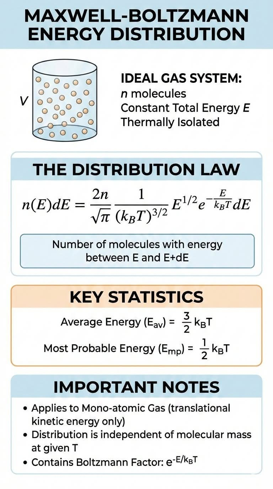
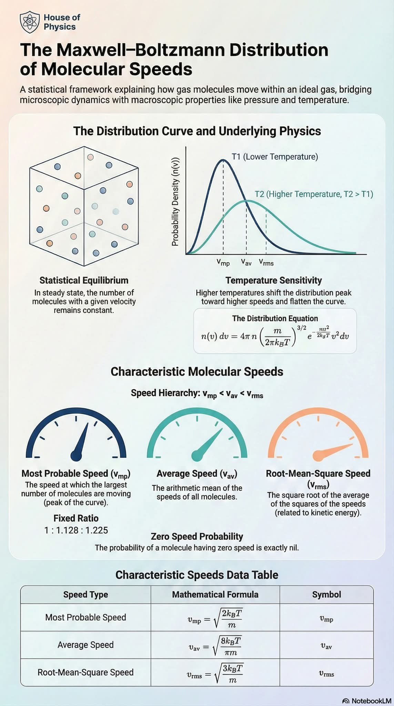



## Two-dimensional Boltzmann gas

 

🔧 [boltzmann_gas_2d.js](https://github.com/zhendrikse/science/blob/main/thermodynamics/boltzmann_gas_2d.js) is based on [Three.js](https://threejs.org/)  

<canvas class="applicationCanvas" id="boltzmannCanvas2d"></canvas>

    <button id="toggle2d">&nbsp;Pause&nbsp;</button>
    <button id="reset2d">Reset</button>
    <button id="show2d">Show</button>
    <button id="hide2d">Hide</button>
    <button id="add2d">+50</button>

    <label for="temperatureSlider2d">
        Cold <input type="range" id="temperatureSlider2d" min="0.05" max="1.0" value=".5" step="0.01"/> Hot
    </label>

<link rel="stylesheet" href="https://unpkg.com/uplot/dist/uPlot.min.css">

## Three-dimensional Boltzmann gas

 

🔧 [boltzmann_gas_3d.js](https://github.com/zhendrikse/science/blob/main/thermodynamics/boltzmann_gas_3d.js) is based on [Three.js](https://threejs.org/)  
⭐ Also available as [boltzmann_gas.py](https://github.com/zhendrikse/physics-in-python/blob/main/vpython/boltzmann_gas.py)

<canvas class="applicationCanvas" id="boltzmannCanvas3d"></canvas>

    <button id="toggle3d">&nbsp;Pause&nbsp;</button>
    <button id="reset3d">Reset</button>
    <button id="show3d">Show</button>
    <button id="hide3d">Hide</button>
    <button id="add3d">+50</button>

    <label for="temperatureSlider3d">
        Cold <input type="range" id="temperatureSlider3d" min="0.05" max="2.0" value=".5" step="0.01"/> Hot
    </label>

## Maxwell-Boltzmann distribution

 

<figure class="left_image">
  
</figure>
<figure class="right_image">
  
</figure>

## Maxwell-Boltzmann distribution: 2D vis à vis 3D

 

### Maxwell-Boltzmann velocity distributions for $\vec{v}$

The velocity distribution for $f(\vec{v}) , d^n\vec{v}$ is given by

#### 3D case

$$ f(\vec{v}) d^3\vec{v} = \left(\frac{m}{2 \pi k_B T}\right)^{3/2} \exp\Big(-\frac{m v^2}{2 k_B T}\Big) d^3\vec{v}$$

#### 2D case

$$ f(\vec{v}) d^2\vec{v} = \left(\frac{m}{2 \pi k_B T}\right) \exp\Big(-\frac{m v^2}{2 k_B T}\Big) d^2\vec{v}$$

* We have $v^2 = v_x^2 + v_y^2 + v_z^2$ in 3 dimensions and $v^2 = v_x^2 + v_y^2$ in 2 dimensions.
* Normalisation because the integral volume $d^n\vec{v}$ depends on the dimension.

### Maxwell-Boltzmann velocity distributions for $\|\vec{v}\|$

In the graphs we reduce to a **radial distribution**, so we take
the “surface of the cirkel/sphere”:

$$
d^n\vec{v} = v^{n-1} dv , d\Omega_n
$$

where $d\Omega_n$ denotes the angular part.
This amounts to an additional factor $v$ for 2D, $v^2$ for 3D.

#### 3D case

$$ f(v) dv = 4\pi \left(\frac{m}{2 \pi k_B T}\right)^{3/2} v^2 \exp\Big(-\frac{m v^2}{2 k_B T}\Big) dv$$

#### 2D case

$$ f(v) dv = \frac{m}{k_B T} , v , \exp\Big(-\frac{m v^2}{2 k_B T}\Big) dv$$

* **Factor $v^{n-1}$** originates from the velocities with the same speeds (surface of a cirkel/sphere).
* This is what is used in the code, e.g. `value = (v / T) * exp(-v*v / (2 * T))` in 2D.



