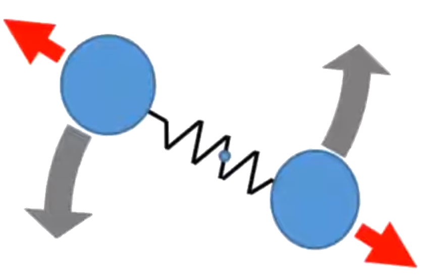



## Equipartition of energy &amp; carbon monoxide gas
<div class="header_line"><br/></div>

This simulation demonstrates the so-called 
[equipartition of energy](https://en.wikipedia.org/wiki/Equipartition_theorem) for a
box with carbon monoxide molecules: every degree of freedom of every CO molecule
ends up having the same expectation value of energy. You may want to watch
[this wonderful video](https://www.youtube.com/watch?v=cTOlW0u1ZuI) that explains
this principle in a very clear and understandable way.



<p style="clear:both;"></p>

🔧 [energy_equipartition.html](https://github.com/zhendrikse/science/blob/main/thermodynamics/code/energy_equipartition.html) is JavaScript and [Three.js](https://threejs.org/) <br/>
⭐ Inspired by [this video](https://www.youtube.com/watch?v=tP5u-V-BLQo) from Jordan Huang<br/>
👉 <span style="color: green">Green curve</span>: averaged kinetic energy of the center of mass<br/>
👉 <span style="color: red">Red curve</span>: averaged vibrational potential energy<br/>
👉 <span style="color: cyan">Cyan curve</span>: averaged vibrational kinetic energy<br/>
👉 <span style="color: yellow">Yellow curve</span>: averaged rotational kinetic energy<br/>
⭐ Also available as [energy_equipartion.py](https://github.com/zhendrikse/physics-in-python/blob/main/vpython/energy_equipartition.py)

## Instructions given in the video
<div class="header_line"><br/></div>

Below you find a copy of the original set of instructions that accompany the video.

### I. Introduction


For a system in thermal equilibrium, every degree of freedom of every particle has the same expectation value of energy, hence the name equipartition of energy.

In the figure, we have 20 artificial molecules, each composed of two atoms, O (red ball)
and C (blue ball), and they are connected by a bond (white cylinder). Each molecule can have translational
motion, vibrational motion, and rotational motion. The translational motion of the center of mass of the 
molecule has 3 degrees of freedom ($f=3$), corresponding to motion in $x, y$, and $z$ and is associated with kinetic energy of the center of mass, `com_K`.

the vibrational motion (red arrows) has ($f=2$) and half of it ($f=1$) is associated
with vibrational kinetic energy `v_K` and half of it ($f=1$) vibrational potential 
energy `v_P`. The rotational motion (grey arrows) has $f=2$, corresponding to
the 2 rotational motions with their axes perpendicular to the bond direction,
and is associated with the rotational kinetic energy `r_K`. For rotational
motion, $f=2$ instead of $f=3$, because the rotation with the axis parallel to the bond direction is not
discernible. Since for each available degree of freedom, the expected energy is the same, therefore
statistically, if we add up the energies of the different types of motions respectively for all molecules and
averaged over time, the ration between them will be 

`avg_com_K : avg_v_K : avg_v_P : avg_r_K = 3 : 1 : 1 : 2`.

(<span style="color:red">Notice: Here we do not consider quantum effect, therefore all 3 types of the motions will be available</span>). In
this homework, we will simulate that.

In addition, we will learn to use Python's module feature to finish the homework in a more systematical way. 
Python provides many useful modules, such as "numpy" and "vpython". For example, every time you write
`from vpython import *`, you can use everything provided by the module "vpython", such as `canvas()`, 
`sphere()`, etc. We can also write our own module. One of the reason is that this module is very useful
and can be used again and again in the future. The other reason is that we do not want the main program to 
look very complicated, so we separate the program into layers, allowing each layer to handle different things.

In this homework, we provide two template files, `diatomic.py`, which is the module file to hand each
individual CO molecule and their collisions, and `VP8.py`, which is the main program. You need to put these
two files into the same file folder. When the module is run for the first time, a `diatomic.pyc` will be generated
and stored in the subfolder `__pychache__`.

### II. The template file of the diatomic module
<div style="border-top: 1px solid #999999"><br/></div>

`diatomic.py`:

```python
from vpython import simple_sphere, color, vector, cylinder, mag, norm, dot, cross, rate

size, m_o, m_c, k_bond = 31E-12, 16.0 / 6E23, 12.0 / 6E23, 18600.0
d = 2.5 * size
dt = 1E-16

class CarbonMonoxide:
    def __init__(self, pos, axis):
        self.O = simple_sphere(pos=pos, radius=size, color=color.red)
        self.C = simple_sphere(pos=pos + axis, radius=size, color=color.blue)
        self.bond = cylinder(pos=pos, axis=axis, radius=size /2., color=color.white)
        self.O.m = m_o
        self.C.m = m_c
        self.O.v = vector(0, 0, 0)
        self.C.v = vector(0, 0, 0)
        self.bond.k = k_bond

    def bond_force_on_O(self):
        return self.bond.k * (mag(self.bond.axis) - d) * norm(self.bond.axis)

    def time_lapse(self, dt):
        self.C.a = -self.bond_force_on_O() / self.C.m
        self.O.a = self.bond_force_on_O() / self.O.m
        self.C.v += self.C.a * dt
        self.O.v += self.O.a * dt
        self.O.pos += self.O.v * dt
        self.C.pos += self.C.v * dt
        self.bond.axis = self.C.pos - self.O.pos
        self.bond.pos = self.O.pos

    def com(self): # center of mass
        return (self.C.pos * self.C.m + self.O.pos * self.O.m) / (self.C.m + self.O.m)

    def com_v(self):
        return (self.C.v * self.C.m + self.O.v * self.O.m) / (self.C.m + self.O.m)

    def v_P(self):
        return self.bond.k * (mag(self.bond.axis) - d) **2 / 2

    def v_K(self):
        C = self.C.m * (dot(self.C.v - self.com_v(), self.bond.axis) / mag(self.bond.axis)) ** 2 /2
        O = self.O.m * (dot(self.O.v - self.com_v(), self.bond.axis) / mag(self.bond.axis)) ** 2 /2
        return C + O

    def r_K(self):
        C = self.C.m * (mag(cross(self.C.v - self.com_v(), self.bond.axis)) / mag(self.bond.axis)) ** 2 /2
        O = self.O.m * (mag(cross(self.O.v - self.com_v(), self.bond.axis)) / mag(self.bond.axis)) ** 2 /2
        return C + O

    def com_K(self):
        return (self.C.m + self.O.m) * mag(self.com_v()) ** 2 /2

def collision(a1, a2):
    v1prime = a1.v - 2 * a2.m / (a1.m + a2.m) * (a1.pos - a2.pos) * dot(a1.v - a2.v, a1.pos - a2.pos) / mag(a1.pos - a2.pos) ** 2
    v2prime = a2.v - 2 * a1.m / (a1.m + a2.m) * (a2.pos - a1.pos) * dot(a2.v - a1.v, a2.pos - a1.pos) / mag(a2.pos - a1.pos) ** 2
    return v1prime, v2prime

if __name__ == "__main__":
    a = CarbonMonoxide(pos=vector(0, 0, 0), axis = vector(2.6 * size, 0, 0))
    a.O.v = vector(1, 1, 0)
    a.C.v = vector(2, -1, 0)
    a.time_lapse(dt)
    print(a.bond_force_on_O(), a.com(), a.v_P(), a.v_K(), a.r_K(), a.com_K())

```

<p style="clear: both;"></p>

