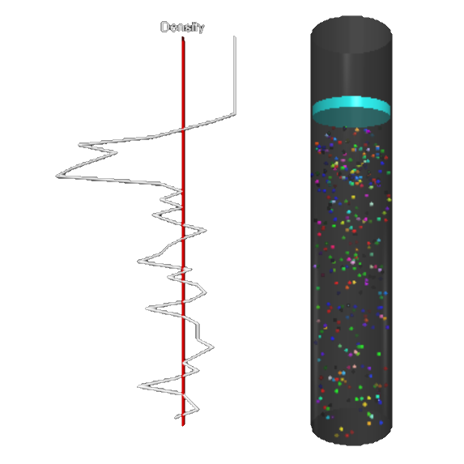
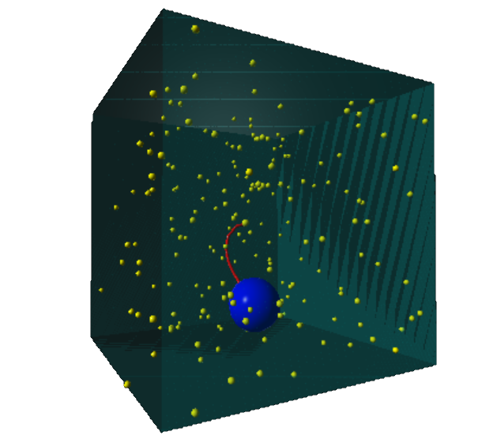



# Thermodynamics

 

<blockquote>
Available energy is the main object at stake in the struggle for existence 
and the evolution of the world. &mdash; 
<a href="https://en.wikipedia.org/wiki/Ludwig_Boltzmann">Ludwig Boltzmann</a>
</blockquote> 

### Boltzmann gas &amp; a two-dimensional Ising spin model

 

<figure class="left_image">
  
  <figcaption>A simulation that shows how the average velocity distribution approaches the theoretically 
  obtained curve.</figcaption>
</figure>
<figure class="right_image">
  
  <figcaption> A two-dimensional Ising spin model showing the magnetization as function of the temperature.
  </figcaption>
</figure>

### Fluid simulation and adiabatic compression of an ideal gas

 

<figure class="left_image">
  
  <figcaption>A simulation that shows the separation of non-mixing fluids.</figcaption>
</figure>
<figure class="right_image">
  
  <figcaption>Adiabatic compression of an ideal gas.</figcaption>
</figure>

### Three-dimensional Brownian motion

 

<figure class="left_image">
  
  <figcaption>This random motion was first described by the Scottish botanist 
  <a href="https://en.wikipedia.org/wiki/Robert_Brown_(botanist,_born_1773)">Robert Brown</a>, who
  observed these motions while looking at pollen through his microscope.</figcaption>
</figure>
<figure class="right_image">
  
  <figcaption>Carbon monoxide gas &mdash; this simulation shows that every degree of freedom of every 
  particle has the same expectation value of energy.</figcaption>
</figure>


