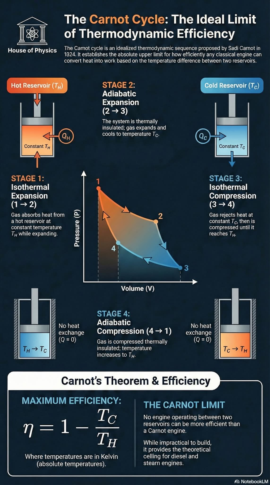



## First law of thermodynamics

 



## Theoretical background

 

The first law of thermodynamics states that energy cannot be created nor destroyed. 
It can only be converted from one form into another.

Formulated more rigorously: in a thermodynamic process involving a closed system,
the increment in internal energy is equal to the difference between the heat that
is either absorbed (or emitted) by the system and the work that is done by it.

<figure style="text-align: center;">
  
</figure>

### Infographics

 

<figure class="left_image">
  
</figure>
<figure class="right_image">
  
</figure>

