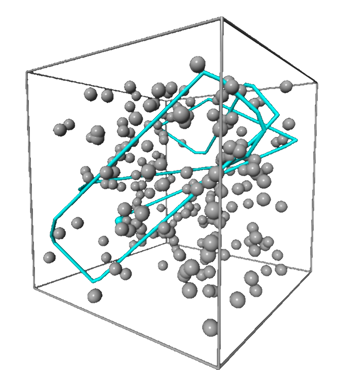
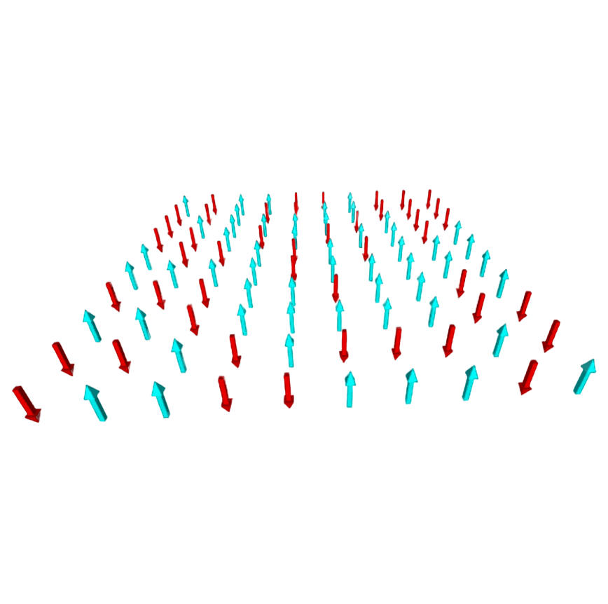

# Thermodynamics

 

### Boltzmann gas &amp a two-dimensional Ising spin model

 

<figure class="left_image">
  
  <figcaption>A simulation that shows how the average velocity distribution approaches the theoretically 
  obtained curve.</figcaption>
</figure>
<figure class="right_image">
  
  <figcaption> A two-dimensional Ising spin model showing the magnetization as function of the temperature.
  </figcaption>
</figure>

