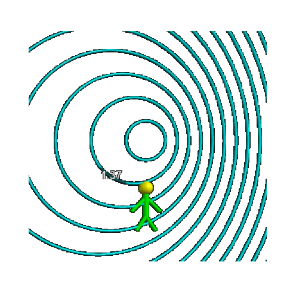



# Vibrations &amp; Waves

 

<blockquote>
Bring forward what is true. Write it so that it is clear. Defend it to your last breath. &mdash;
<a href="https://en.wikipedia.org/wiki/Ludwig_Boltzmann">Ludwig Boltzmann</a>
</blockquote> 

### Wave propagation in a pool

 

<figure class="left_image">
  
  <figcaption> 
  <a href="https://en.wikipedia.org/wiki/Central_differencing_scheme">Central finite difference method</a> 
  used to model wave propagation in a pool with an obstruction. 
  </figcaption>
</figure>
<figure class="right_image">
  
  <figcaption><a href="https://en.wikipedia.org/wiki/Central_differencing_scheme">Finite difference method</a> 
  applied to wave propagation in case of a moving obstruction. 
  </figcaption>
</figure>

  
<a>&dArr; The central finite difference method &uArr;</a>

The two-dimensional <a href="https://en.wikipedia.org/wiki/Wave_equation">scalar wave equation</a> is given by:

$$\frac{\partial^2 u}{\partial t^2} = c^2 \left(
\frac{\partial^2 u}{\partial x^2} + \frac{\partial^2 u}{\partial y^2} \right)$$

where

<ul>
  <li>$c$ designates the speed of the wave</li>
  <li>$u$ is a scalar field representing the displacement</li>
  <li>$x$, $y$ are the two spatial coordinates and t the time coordinate.</li>
</ul>

To solve this equation numerically, we create a grid of size $L_x \times L_y$
with equal spacings 

$dx =\frac{L_x}{N_x-1}$ \text{ and } $dy = \frac{L_y}{N_y-1}$

There is a balance to be struck between the number of points $N_x$ and $N_y$
(the resolution) on the one hand and the computation time on the other.
Of course, the same holds for the time increment $dt$.

We denote the magnitude of $u$ at point $(i, j)$ on the grid at any given
time $n$ by $ u^{n}_{i, j}$, where $x_i = idx$ and $y_i = jdy$ for 
$i \in [0, \ldots, N_x)$ and $ j \in [0, 1, \ldots, N_y)$.

Note that the round brackets imply that in our code our for-next loops 
will only run to $N_x - 1$ and $N_y - 1$. This ensures that we arrive 
exactly at the endpoints $L_x$ and $L_y$ respectively.

As opposed to the <a href="https://en.wikipedia.org/wiki/Euler_method">Euler algorithm</a>,
that only uses the slope of a function at each point,
the central difference formula estimates the slope
by using points on either side of that point. Due to symmetry,
this results in a more accurate approximation.
So for each time step, we find a new scalar value by looking at 
the current point, and the previous point.

Bearing in mind the definition of a derivative of a function (in one dimension, so only dependent on $x$)

$$f'(x)=\lim_{h \rightarrow 0} \dfrac{f(x + h) - f(x)}{h}$$

we find for each point $x$ at a distance $h$ to both left and right:

$$f'(x) \approx \frac{f(x + h) - f(x - h)}{2h} $$

This implies that an estimate for the second derivative is given by:

$$f''(x) \approx \frac{f(x + h) - 2f(x) + f(x - h)}{h^2} $$

Our wave equation contains these second derivatives both in time

$$\frac{\partial^2 f}{\partial t^2} \approx \frac{f(x, t + h) - 2f(x, t) + f(x, t - h)}{h^2}$$

as well as in spatial coordinates:

$$\frac{\partial^2 f}{\partial x^2} \approx \frac{f(x + h, t) - 2f(x, t) + f(x - h, t)}{h^2}$$

We want to find $f(x+h,t)$, the 'new' point. Using the 1D Wave
Equation and plugging in the values into: $$\frac{\partial^2
f}{\partial t^2} = c^2 \frac{\partial^2 f}{\partial x^2}$$

We get $$f(x+h,t) = 2f(x,t) - f(x-h,t) + c^2 \frac{h^2}{\Delta
t^2} \left(f(x,t+h) - 2f(x,t) + f(x,t-h\right))$$

### The Doppler effect for sound waves

 

<figure class="left_image">
  
  <figcaption>Visualisation of the Doppler effect for sound waves.</figcaption>
</figure>
<figure class="right_image">
  
  <figcaption>Visualisation of the Doppler effect for sound waves.</figcaption>
</figure>

### Traveling and longitudinal waves

 

<figure class="left_image">
  
  <figcaption>A simulation of a traveling wave in a string.</figcaption>
</figure>
<figure class="right_image">
    
    <figcaption>Discover what happens by changing the number of bodies.</figcaption>
</figure>

### Harmonic oscillations

 

<figure class="left_image">
  
  <figcaption>A simulation of a wave with pendulums.</figcaption>
</figure>
<figure class="right_image">
  
  <figcaption>Visualization of the vibrations in a suspended spring.</figcaption>
</figure>

### 3D wave interference patterns

 

<figure class="left_image">
  
  <figcaption>"[...] the light that comes out is … is waves, just like in the swimming pool" &mdash; 
  <a href="https://www.youtube.com/watch?v=1qQQXTMih1A">Richard P. Feynman</a>.
  </figcaption>
</figure>
<figure class="right_image">
  
  <figcaption>Three-dimensional interference pattern by two oscillating point sources.</figcaption>
</figure>

### Waves explained &amp; normal modes of rectangular vibrating membrane &amp;

 

<figure class="left_image">
  
  <figcaption>Longitudinal and transversal waves.</figcaption>
</figure>
<figure class="right_image">
  
  <figcaption>Visualization of the normal modes of a vibrating membrane.</figcaption>
</figure>

## References

 

- [Acoustics and Vibration animations](https://www.acs.psu.edu/drussell/demos.html), by Dr. Daniel A. Russell!
- [The classic wave equation](https://chem.libretexts.org/Courses/Grinnell_College/CHM_364%3A_Physical_Chemistry_2_(Grinnell_College)/02%3A_The_Classical_Wave_Equation) in LibreTexts Chemistry

