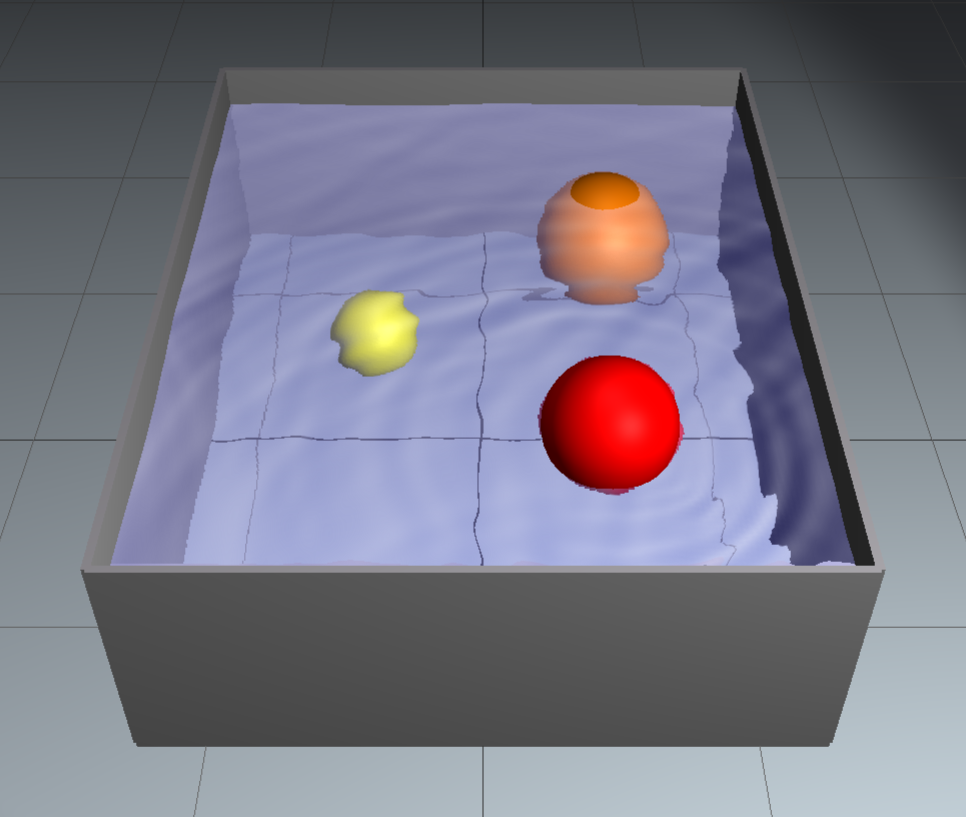



# Wave propagation around a moving obstacle

 



## A more sophisticated simulation in pure Javascript

 

[Matthias Müller](https://www.matthiasMueller.info/tenMinutePhysics) wrote
a more sophisticated water simulation that is implemented using a so-called grid-based 
or Eulerian approach. He personally elaborates on this simulation 
in [this video](https://www.youtube.com/watch?v=XmzBREkK8kY) 
on his [Ten Minute Physics](https://www.youtube.com/c/TenMinutePhysics) YouTube channel.

<figure style="float: center; text-align: center;">
  
  <figcaption>Click on the above image to activate the Euler-based water simulation 
  which was implemented using pure Javascript by 
  <a href="https://www.matthiasMueller.info/tenMinutePhysics">Matthias Müller</a>.</figcaption>
</figure>

