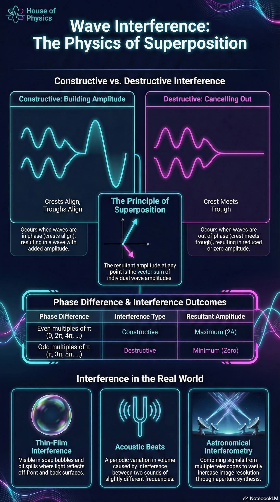



## [Young&apos;s interference experiment](https://en.wikipedia.org/wiki/Double-slit_experiment)

 

In this visualization, the interference pattern is generated "dynamically", i.e. by calculating
the propagation of the waves using a [finite difference method](https://pythonnumericalmethods.studentorg.berkeley.edu/notebooks/chapter23.03-Finite-Difference-Method.html).

🔧 Original [double slit experiment.py](https://github.com/NelsonHackerman/Random_python_ideas/blob/main/double%20slit%20experiment.py) by [Nelson Hackerman](https://github.com/NelsonHackerman)  
🔧 Ported to Javascript and [three.js](https://threejs.org/) by [Zeger Hendrikse](https://github.com/zhendrikse/), see [double_slit_interference.js](https://github.com/zhendrikse/science/blob/main/waves/double_slit_interference.js)  
👉 [VPython](https://vpython.org/) version available as [dynamic_double_slit.py](https://github.com/zhendrikse/physics-in-python/blob/main/vpython/dynamic_double_slit.py), but significantly slower!

    <canvas class="applicationCanvas" id="doubleSlitCanvas"></canvas>

    <button id="resetButton">🔄 Reset View</button>&nbsp;&nbsp;
    <label for="slitSizeSlider"><input type="range" min="3" max="25" value="6" class="slider" id="slitSizeSlider"/> Slit size</label>

## 3D interference of two oscillating sources

 

🔧 This [3d-two-source-interference.js](https://github.com/zhendrikse/science/blob/main/waves/3d-two-source-interference.js) uses [Three.js](https://threejs.org/) 

    <canvas class="applicationCanvas" id="3dInterferenceCanvas"></canvas> 

## 2D interference of two oscillating sources

 

🔧 This [2d-two-source-interference.js](https://github.com/zhendrikse/science/blob/main/waves/2d-two-source-interference.js) is 100% JavaScript 
👉 Based on [interference.html](https://physics.weber.edu/schroeder/software/Interference.html) by [Daniel V. Schroeder](https://physics.weber.edu/schroeder/)  (Weber State University) 
🔑 Updated, refactored and extended by [Zeger Hendrikse](https://www.hendrikse.name/) 

    <canvas class="applicationCanvas2D" id="2dInterferenceCanvas"></canvas>

    <label>Distance:
    <input type="range" id="separationSlider" min="0" max="1" step="0.01" value="0.5" />
    </label>  

    <label>k = <output id="kReadout"></output>
    <input type="range" id="kSlider" min="0.01" max="0.3" step="0.005"/>
    </label>  

    <label>ω = <output id="omegaReadout"></output>
    <input type="range" id="omegaSlider" min="0" max="10" step=".1"/>
    </label>  
    <button id="pauseButton">Start</button>

### The physics of superposition

 

<figure style="text-align: center;">
  
  <figcaption>This excellent visual guide originates from 
    <a href="https://www.facebook.com/HouseOfPhysics/">House of Physics</a>.
  </figcaption>
</figure>

