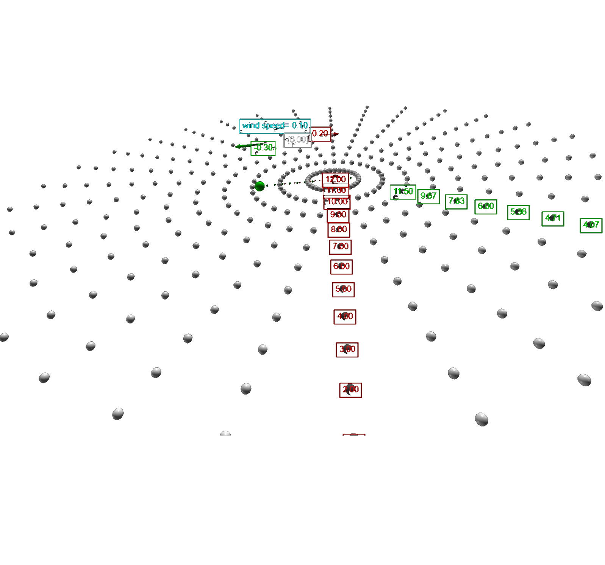

# Vibrations &amp; Waves

 

<blockquote>
Bring forward what is true. Write it so that it is clear. Defend it to your last breath. &mdash;
<a href="https://en.wikipedia.org/wiki/Ludwig_Boltzmann">Ludwig Boltzmann</a>
</blockquote> 

### Wave propagation in a pool

 

<figure class="left_image">
  
  <figcaption> 
  <a href="https://en.wikipedia.org/wiki/Central_differencing_scheme">Central finite difference method</a> 
  used to model wave propagation in a pool with an obstruction. 
  </figcaption>
</figure>
<figure class="right_image">
  
  <figcaption><a href="https://en.wikipedia.org/wiki/Central_differencing_scheme">Finite difference method</a> 
  applied to wave propagation in case of a moving obstruction. 
  </figcaption>
</figure>

  
<a>&dArr; The central finite difference method &uArr;</a>

The two-dimensional <a href="https://en.wikipedia.org/wiki/Wave_equation">scalar wave equation</a> is given by:

$$\frac{\partial^2 u}{\partial t^2} = c^2 \left(
\frac{\partial^2 u}{\partial x^2} + \frac{\partial^2 u}{\partial y^2} \right)$$

where

<ul>
  <li>$c$ designates the speed of the wave</li>
  <li>$u$ is a scalar field representing the displacement</li>
  <li>$x$, $y$ are the two spatial coordinates and t the time coordinate.

To solve this equation numerically, we create a grid of size $L_x \times L_y$
with with spacings $dx =\dfrac{L_x}{N_x-1}$ and $dy = \dfrac{L_y}{N_y-1}$.
There is a balance to be struck between the number of points $N_x$ and $N_y$
(the resolution) on the one hand and the computation time on the other.

Of course, the same holds for the time increment $dt$.

The magnitude of $u$ at $ (i,j) $
at time step $n$ , we have: $ f^{n}_{i,j} $ and $ x_i = i \cdot
dx $ for $ i = 0, 1, \ldots, N_x - 1 $ and $ y_j = j \cdot dy $
for $ j = 0, 1, \ldots, N_y - 1 $

This ensures, that when the future for-loop acting on $i$ or
$j$ reaches $N_x - 1$ or $N_y - 1$, notice that in the previous
$dx$ or $dy$, the denominator cancels out, leaving simply $L_x$
or $L_y$, the longest designated length, essentially reaching
the end of the wave and ensuring that it does not continue to
infinity.

Time steps: $t^n = n \cdot dt$ for $ n = 0, 1, \ldots, M$,
again, ensuring that when the for-loop reaches final time step
$M$, terms cancel out, and we are left with the total time $T$

The central difference formula is a way to estimate the slope
(derivative) of a function at a specific point by using points
on either side of that point. It gives a better approximation
than just looking ahead or behind the point, due to symmetry.
When graphing the wave, when finding the new point (next point
on the wave), it looks at the current point, and the previous
point.

In one dimension, starting simple, to find the slope of a
function at a point $x$:

Take two points: one just before $x$ ,lets call it $(x - h)$ and
one just after $x$ can call it $(x + h)$. Calculate the
difference in the function values at these points: $f(x + h)$
and $f(x - h)$. Divide this difference by the distance between
the points which is $2h$.

So we get a formula looks like this:

$$f'(x) \approx \frac{f(x + h) - f(x - h)}{2h} $$

Second Derivative:

To estimate the curvature (second derivative) at point $x$:

Use the function values at the points $(x + h)$, $x$, and $(x -
h)$. Combining these values in the following way:

$$f''(x) \approx \frac{f(x + h) - 2f(x) + f(x - h)}{h^2} $$

Written out in terms of the wave equation, for the second
derivative of time:

$$\frac{\partial^2 f}{\partial t^2} \approx \frac{f(x, t + h) -
2f(x, t) + f(x, t - h)}{h^2}$$

In 1D, with only $x$, the spacial second derivative of $x$ is
$$\frac{\partial^2 f}{\partial x^2} \approx \frac{f(x + h, t) -
2f(x, t) + f(x - h, t)}{h^2}$$

We want to find $f(x+h,t)$, the 'new' point. Using the 1D Wave
Equation and plugging in the values into: $$\frac{\partial^2
f}{\partial t^2} = c^2 \frac{\partial^2 f}{\partial x^2}$$

We get $$f(x+h,t) = 2f(x,t) - f(x-h,t) + c^2 \frac{h^2}{\Delta
t^2} \left(f(x,t+h) - 2f(x,t) + f(x,t-h\right))$$

To find the 'new', we need to use both the 'old' and the
'current'. Creating empty lists for all 3 terms:

### The Doppler effect for sound waves

 

<figure class="left_image">
  
  <figcaption>Visualisation of the Doppler effect for sound waves.</figcaption>
</figure>
<figure class="right_image">
  <!-- Space reserved for future picture
  <figcaption>For the future.</figcaption>
  -->
</figure>

